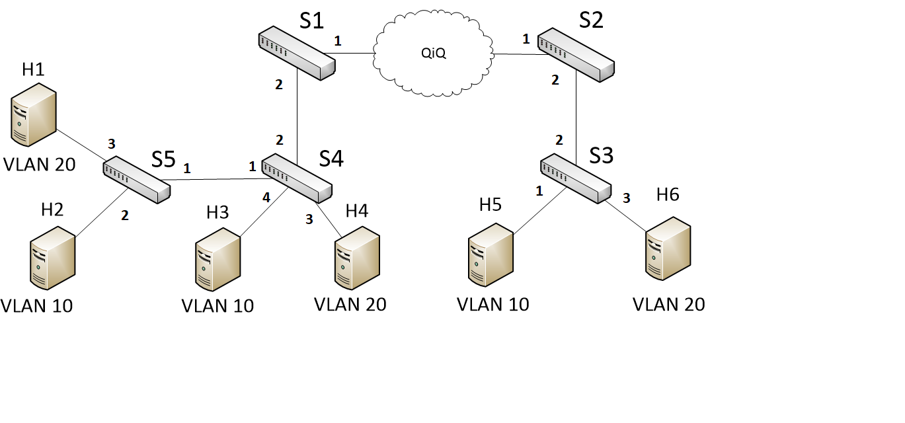
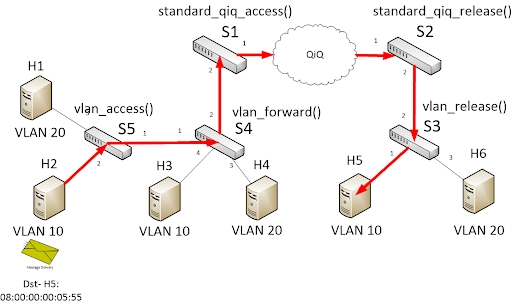
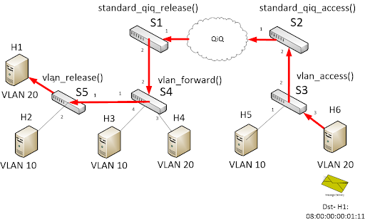
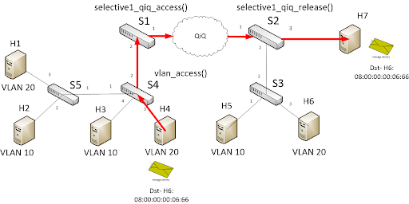

# Implementing Basic QiQ

## Introduction

The objective of this exercise is to write a P4 program that
implements basic QiQ.

Your switch will have tables, which the control plane will
populate with static rules.

We will use the following topology for this exercise:


Our P4 program will be written for the V1Model architecture implemented
on P4.org's bmv2 software switch. The architecture file for the V1Model
can be found at: /usr/local/share/p4c/p4include/v1model.p4. This file
desribes the interfaces of the P4 programmable elements in the architecture,
the supported externs, as well as the architecture's standard metadata
fields. We encourage you to take a look at it.

## Step 1: Run the (incomplete) starter code

The directory with this README also contains a skeleton P4 program,
`basic.p4`, which initially drops all packets. Your job will be to
extend this skeleton program to properly forward IPv4 packets.

Before that, let's compile the incomplete `basic.p4` and bring
up a switch in Mininet to test its behavior.

1. In your shell, run:
   ```bash
   make run
   ```
   This will:
   * compile `basic.p4`, and
   * start the triangle-topo in Mininet and configure all switches with
   the appropriate P4 program + table entries, and
   * configure all hosts with the commands listed in
   [triangle-topo/topology.json](./triangle-topo/topology.json)

2. You should now see a Mininet command prompt. Then you can open terminal of Hosts h1, h2, h3, h4, h5, h6
   ```bash
   mininet> xterm h1 h2 h3 h4 h5 h6
   ```
3. Type `exit` to leave each xterm and the Mininet command line.
   Then, to stop mininet:
   ```bash
   make stop
   ```
   And to delete all pcaps, build files, and logs:
   ```bash
   make clean
   ```
   
**A note about the control plane**

A P4 program defines a packet-processing pipeline, but the rules within each table are inserted by the control plane. When a rule matches a packet, its action is invoked with parameters supplied by the control plane as part of the rule.

## Step 2: Test Standard QiQ - Enable H2 send message to H5



In order to send packets from H2 to H5, S5 will add VLAN tags with VLAN ID (10) to packets, and S4 will forward packet to S1. When the packets are sent to S1, it will be assigned standard QiQ (Outer) Tags depend on the ingress port. Ingress port is the port of switch receiving the packets. Then, the packet will be sent to S2, S2 will use QiQ (Outer) Tag ID with VID (110) to decide which is the egress port to send the packets out. In this case, S2 will release the QiQ Tags before send the packets to S3. S3 will send the packet to H5, after check the MAC address and VLAN ID. The packets also be removed VLAN tags by S3.

Use the cmd to show all messages sent to H5:
   ```bash
   h5> ./receive.py
   ```
Use the cmd to send a message from H2 to H5:  
   ```bash
   h2> ./send_vlan.py 0.0.0.0 08:00:00:00:05:55 "H2 Hello H5"
   ```
H5 will receive a packet sent from H2 with the payload "H2 Hello H5"

**In the test, when the packet send from H2 to network, the tables below will be applied and call an action:**
   
   Switch S5 - vlan_access_exact table             -> call action: vlan_access
   
   Switch S4 - vlan_exact table                    -> call action: vlan_forward
   
   Switch S1 - standard_qiq_access_exact  table    -> call action: standard_qiq_access
   
   Switch S2 - standard_qiq_exact table            -> call action: standard_qiq_release
   
   Switch S3 - vlan_exact table                    -> call action: vlan_release

## Step 3: Test Standard QiQ - Enable H6 send message to H1



In order to send packets from H6 to H1, we do a similar way with Step 2. In the case, we use VLAN ID (20).

Use the cmd to show all messages sent to H1:
   ```bash
   h1> ./receive.py
   ```
Use the cmd to send a message from H6 to H1:
   ```bash
   h6> ./send_vlan.py 0.0.0.0 08:00:00:00:01:11 "H6 Hello H1"
   ```
H1 will receive a packet sent from H6 with the payload "H6 Hello H1"

**In the test, when the packet send from H6 to network, the tables below will be applied and call an action:**
   
   Switch S3 - vlan_access_exact table             -> call action: vlan_access
   
   Switch S2 - standard_qiq_access_exact table     -> call action: standard_qiq_access
   
   Switch S1- standard_qiq_exact table             -> call action: standard_qiq_release
   
   Switch S4 - vlan_exact table                    -> call action: vlan_forward
   
   Switch S5 - vlan_exact table                    -> call action: vlan_release


## Step 4: Test **Selective QiQ - S1 and S2 forward all packets, received from H6, to H7**



In order to forward all packets received from H4 to H7, we need to design a selective QiQ policy in S1 and S2. The selective QiQ will base on src MAC to assign a QiQ (Outer) Tag ID. When S2 receive packets from S1, S2 will use QiQ (Outer) Tag ID to decide the egress port to send packets out.

Use the cmd to show all messages sent to H6 and H7:
   ```bash
   h6> ./receive.py
   ```
   ```bash
   h7> ./receive.py
   ```
Use the cmd to send a message from H4 to H6, but the packet will be forwarded to H7 by S2  
   ```bash
   h4> ./send_vlan.py 0.0.0.0 08:00:00:00:06:66 "H4 Hello H6"
   ```
H7 will receive a packet sent from H4 with the payload "H4 Hello H6"

**In the test, when the packet send from H4 to network, the tables below will be applied and call an action:**
   
   Switch S4 - vlan_access_exact table                -> call action: vlan_access
   
   Switch S1 - selective1_qiq_access_exact table      -> call action: selective1_qiq_access
   
   Switch S2- selective1_qiq_exact table              -> call action: selective1_qiq_release


#### Cleaning up Mininet

In the latter two cases above, `make run` may leave a Mininet instance
running in the background. Use the following command to clean up
these instances:

```bash
make stop
```

